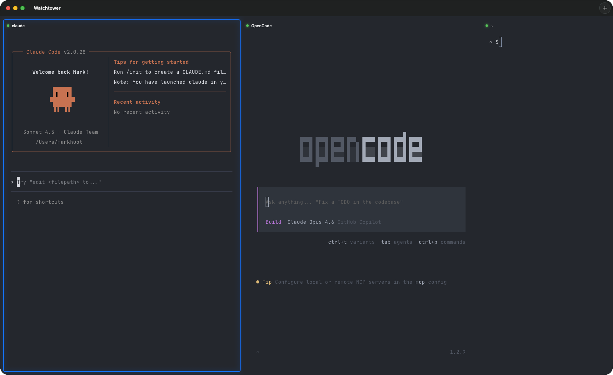

# It's Alive: Building a Multi-Pane Terminal with Ghostty's C API

Watchtower is a macOS terminal app. It embeds [Ghostty](https://ghostty.org) via its C library (`libghostty`) and presents multiple 80-column terminal panes in a horizontally scrolling layout. The entire thing was built in roughly three days, almost entirely through AI-assisted pair programming sessions using [OpenCode](https://opencode.ai).

This post covers what Watchtower is, why it exists, and how the first working version came together.



## The idea

The concept is simple: a terminal app designed around the way AI coding tools work. When you're running multiple agents, reviewing diffs, tailing logs, and running builds simultaneously, you want to see everything at once. Not tabs. Not a single maximized window. A horizontal strip of fixed-width terminals, each showing exactly 80 columns, that you can scan left to right like a dashboard.

The 80-column constraint is deliberate. It's wide enough for code and command output, narrow enough that you can fit three or four panes on screen without any of them feeling cramped. Terminal output from most tools is designed for this width anyway.

## Why Ghostty

Ghostty exposes a C API (`libghostty`) that handles all of the hard terminal emulation work: VT parsing, grid state, GPU-accelerated rendering via Metal, font shaping, and the PTY lifecycle. The API ships as a static library (`libghostty.a`, ~272MB) inside an xcframework. You create an app object, create surfaces, feed them keyboard and mouse events, and Ghostty handles rendering into an NSView.

The init flow looks like this:

```
ghostty_init()
  -> ghostty_config_new() / load / finalize
  -> ghostty_app_new(&runtime_cfg, config)
  -> ghostty_surface_new(app, &surface_cfg)   // one per terminal pane
```

Each surface gets its own NSView. The surface config accepts a `command` field (what process to run), environment variables, a working directory, and a scale factor. Ghostty takes it from there.

The alternative would have been building terminal emulation from scratch or forking an existing terminal app. Using Ghostty's C API meant the entire terminal layer -- rendering, input handling, scrollback, selection, clipboard -- came for free. The trade-off is that you're linking against a 272MB static library and working with a C API from Swift, which involves bridging headers, `Unmanaged` pointer juggling, and the occasional `strdup`/`free` dance for C string lifetimes.

## The first commit

The first commit landed at 12:50 AM on February 20, 2026. It contained a working (if minimal) SwiftUI app with:

- `WatchtowerApp.swift` -- the `@main` entry point
- `GhosttyAppManager.swift` -- a singleton wrapping `ghostty_app_t` with runtime callbacks
- `GhosttyTerminalView.swift` -- an `NSViewRepresentable` wrapping an NSView that hosts a Ghostty surface, including keyboard input (`NSTextInputClient`), mouse handling, and surface lifecycle
- `ContentView.swift` -- a horizontal `ScrollView` of terminal panes with a toolbar (+) button
- `TerminalPaneView.swift` -- individual pane UI with a header bar showing status and title
- `TerminalModel.swift` -- the data model for each terminal

The Xcode project links against Metal, MetalKit, QuartzCore, CoreText, and `libghostty.a`. The bridging header is a single `#include` of `ghostty.h`.

## Getting it to actually run

The first build compiled. But "it compiles" and "it works" are different things.

The first runtime test happened later that morning. The AGENTS.md at the time noted the app "hasn't been tested at runtime before" and that "PTY spawning may require sandbox entitlement changes." The app launched, terminals rendered, and shells spawned. The core bet -- that Ghostty's C API could be embedded in a custom SwiftUI shell -- paid off.

Then the bugs started.

## Mouse coordinates were wrong

Text selection was broken. Clicking at the top of a terminal selected text at the bottom. Two issues:

1. **Missing Y-flip.** AppKit's coordinate system has its origin at the bottom-left. Ghostty expects top-left. The fix: `frame.height - loc.y`.

2. **Double-scaling.** The code called `convertToBacking()` on mouse coordinates before passing them to Ghostty. But Ghostty's embedded runtime already multiplies by the content scale factor internally (in `cursorPosToPixels` in `embedded.zig`). On Retina displays, every coordinate was doubled.

The reference implementation in Ghostty's own macOS app (`SurfaceView_AppKit.swift`) passes unscaled, view-local, top-left-origin coordinates. Once the Watchtower code matched that pattern, selection worked correctly.

## Drag-and-drop pane reordering

Each terminal pane has a header bar showing a status indicator and the terminal title. Dragging the header bar reorders panes. The implementation went through several iterations:

- **SwiftUI's `.onDrag` hijacked all mouse events**, breaking click-to-focus on the title bar. Replaced with a custom `DragSourceNSView` (`NSViewRepresentable` wrapping an `NSView`) that tracks `mouseDown`/`mouseDragged`/`mouseUp` with a 5-pixel drag threshold. Clicks below the threshold call `focusTerminal()`. Drags above it start an `NSDraggingSession`.

- **Drop indicators, not live reordering.** Rather than shuffling panes around during a drag, vertical glow indicators appear between panes to show where the drop will land. The indicator's width stays constant (visible bar + padding), only the fill color changes, preventing layout shift during the drag.

- **Detecting drag end in SwiftUI** required `NSEvent.addLocalMonitorForEvents(matching: .leftMouseUp)` because SwiftUI doesn't provide an `onDragEnded` callback.

## Pane resizing

Panes have invisible resize handles between them. The first implementation used `DragGesture` with `value.translation.width` in local coordinates, combined with snap-to-grid logic that rounds widths to ~9px character cell boundaries. This created a feedback loop: snap wider, handle moves, local coordinate origin shifts, raw width drops, snap narrower, repeat. The fix was switching to global coordinates and capturing an absolute anchor point on drag start, computing deltas from there.

A separate issue: `window.isMovableByWindowBackground = true` (set for the transparent titlebar) made the entire content area a drag handle, intercepting resize gestures. Setting it to `false` and relying on the standard titlebar for window dragging fixed it.

## The transparent titlebar

The window titlebar uses `titlebarAppearsTransparent = true` with `titleVisibility = .visible` so the traffic lights and title text remain but the background blends into the terminal content. Getting the title text and traffic light dots to render correctly against the dark background required setting `NSApplication.shared.appearance = NSAppearance(named: .darkAqua)` at the app level. Per-window appearance settings weren't sufficient.

## Terminal status and the single source of truth

Each pane shows a colored status circle: green for idle, yellow for active (a foreground process is running), red for failed (non-zero exit). The initial implementation tracked status via Ghostty's `commandFinished` and `childExited` callbacks, checking exit codes. But this disagreed with Ghostty's own assessment of whether a surface had a running process.

The window-close confirmation dialog, added to warn before closing windows with active sessions, used `ghostty_surface_needs_confirm_quit()` -- a Ghostty C API that directly queries the surface state. It was more accurate than the callback-based tracking. A fresh shell would show yellow (no `commandFinished` event had fired yet) even though Ghostty internally knew it was idle.

The fix was to unify both systems on `ghostty_surface_needs_confirm_quit()` as the single source of truth. The status enum was renamed from `.running`/`.succeeded` to `.active`/`.idle` to reflect the actual semantics.

## CI and distribution

A GitHub Actions workflow went in early. The build pipeline:

1. Check out with recursive submodules (Ghostty is a git submodule)
2. Install Zig 0.15.2 (Ghostty's build tool)
3. Build `libghostty.a` via `zig build -Doptimize=ReleaseFast -Demit-docs=false -Demit-xcframework=true -Demit-macos-app=false`
4. Build Watchtower via `xcodebuild`
5. Code sign with a Developer ID Application certificate
6. Notarize with Apple's notary service
7. Create a GitHub Release with calendar versioning (`YYYY.MM.NN`)

The `-Demit-macos-app=false` flag was a non-obvious requirement. Ghostty's build system defaults `emit-macos-app` to match `emit-xcframework`. Without explicitly disabling it, CI tried to build the full Ghostty macOS app, which requires Sparkle, code signing, and other dependencies not available on a CI runner.

Notarization failed twice before succeeding. The first failure was a missing `--timestamp` flag for secure timestamps. The second was Xcode injecting the `com.apple.security.get-task-allow` debug entitlement, which Apple's notary service rejects. Both were fixed with build flags: `OTHER_CODE_SIGN_FLAGS=--timestamp` and `CODE_SIGN_INJECT_BASE_ENTITLEMENTS=NO`.

The `libghostty` build (the expensive step) is cached via `actions/cache@v4` with `save-always: true`, keyed on hashes of the Ghostty submodule's Zig source files. On cache hit, both Zig installation and the library build are skipped entirely.

## Small details that add up

A few things that made the app feel less like a prototype:

- **New panes inherit context.** A new terminal opens to the right of the focused pane (not at the end of the list), inherits the focused pane's working directory via Ghostty's `GHOSTTY_ACTION_PWD` callback (triggered by OSC 7), and copies the focused pane's width.

- **The pane header shows the abbreviated CWD** flush right (e.g., `~/Sites/eyes`), replacing the home directory prefix with `~`.

- **Window-inactive dimming.** When the window loses focus, the highlighted pane's border drops to 30% opacity and the glow disappears. The `isWindowActive` state lives on the `GhosttyAppManager` singleton, toggled by `applicationDidBecomeActive`/`applicationDidResignActive`.

- **Focus mode.** `Cmd+Shift+Enter` zooms into a single pane, hiding the others. The `ScrollViewReader` scrolls the focused pane to center.

- **Keyboard shortcuts** were normalized from `Cmd+Left/Right` to `Cmd+Shift+[/]` for pane switching, matching the macOS convention used by Safari, Chrome, and Terminal.app.

- **Close confirmation** checks all Ghostty surfaces via `ghostty_surface_needs_confirm_quit()` before allowing window close or app quit.

## What's next

The current work is moving toward user-configurable actions. The (+) toolbar button already supports "New Workspace" (which creates a git worktree and opens a terminal in it), but the plan is to generalize this into a system where scripts in `.watchtower/actions/` define custom terminal actions -- Docker containers, SSH sessions, nix shells, anything. The script becomes the terminal's process via Ghostty's surface config `command` field.

The app is rough. The README still says "not yet tested at runtime." The commit messages are half `wip`. But it works: multiple terminals, correct rendering, proper input handling, drag-and-drop reordering, and signed releases shipping from CI. Three days from first commit to a notarized macOS app.
